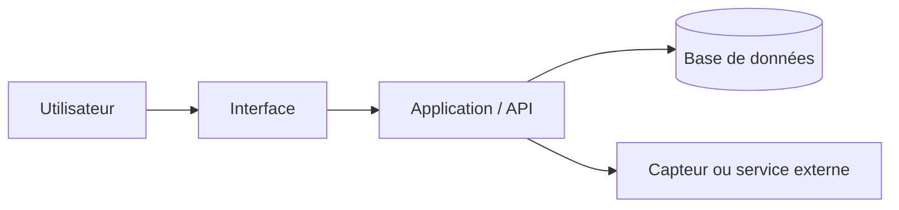
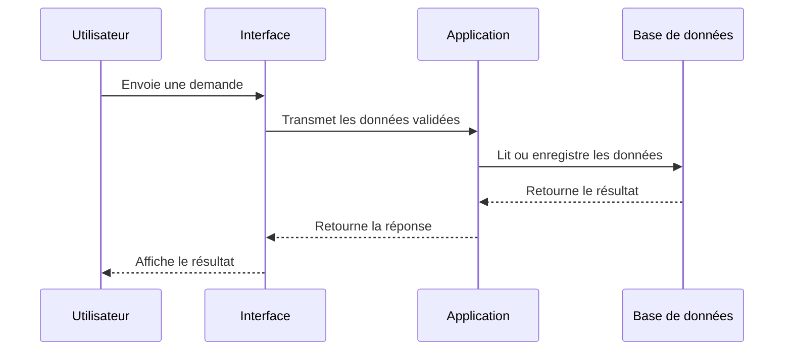

# Atelier WEB (CFPT-EI)
## Documentation

### À quoi sert un README sur GitHub ?

Un fichier `README.md` est la porte d’entrée d’un dépôt GitHub. Il donne une vue d’ensemble du projet et permet à une personne qui découvre le dépôt de comprendre rapidement son objectif, son installation, son utilisation et l’emplacement de la documentation détaillée. GitHub affiche généralement ce fichier sur la page principale du dépôt.

- [À propos du fichier README — GitHub Docs](https://docs.github.com/fr/repositories/managing-your-repositorys-settings-and-features/customizing-your-repository/about-readmes)
- [Syntaxe Markdown de base — GitHub Docs](https://docs.github.com/github/writing-on-github/getting-started-with-writing-and-formatting-on-github/basic-writing-and-formatting-syntax)

### Cheat sheet Markdown GitHub

- [Markdown CheatSheet](https://github.com/adam-p/markdown-here/wiki/Markdown-Cheatsheet#links)
- [Syntaxe Markdown de base — GitHub Docs](https://docs.github.com/github/writing-on-github/getting-started-with-writing-and-formatting-on-github/basic-writing-and-formatting-syntax)

### C’est quoi un cahier des charges déjà ?

Le cahier des charges définit le besoin auquel le projet doit répondre. Il sert d’accord de référence entre les personnes concernées : il explique le problème, les utilisateurs visés, les fonctions attendues, les contraintes et les critères qui permettront de dire si le résultat est acceptable.

1. [ORSYS le mag — Projet informatique : comment rédiger un bon cahier des charges](https://www.orsys.fr/orsys-lemag/projet-informatique-comment-rediger-un-bon-cahier-des-charges/)
2. [TopExemples — Exemple de cahier des charges de projet informatique](https://topexemples.fr/exemple-de-cahier-des-charges-projet-informatique/)
3. [ISO/IEC/IEEE 29148:2018 — Requirements engineering](https://www.iso.org/standard/72089.html)

### La méthode en 6 étapes, quésaco ?

1. [La théorie](https://www.frecem.ch/fileadmin/user_upload/Formation/Menuisier-Ebeniste/CFC_Menuisier_Ebeniste/Classeurs_CIE/1_4_IPDRCE.pdf)
2. [La méthode des 6 étapes en résumé](https://www.cifc-vd.ch/docs/18_mois/ci_1/2._la_methode_des_6_etapes.pdf)

---

# Documentation technique et utilisateur d’un projet informatique

## Objectif du document

La documentation d’un projet informatique rend le travail **compréhensible**, utilisable, vérifiable et maintenable. Elle s’adresse en général à deux publics complémentaires :

- **Le public utilisateur** : personnes qui installent, démarrent et utilisent l’application ou le dispositif.
- **Le public technique** : développeurs, enseignants, évaluateurs ou futurs mainteneurs qui doivent comprendre la conception, modifier le code, reproduire l’installation ou diagnostiquer un problème.

Un bon document ne se limite pas à raconter ce qui a été fait. Il doit permettre de répondre à ces questions :

- Quel problème le projet résout-il ?
- Quelles fonctions sont prévues et quelles contraintes doivent être respectées ?
- Comment installer et utiliser la solution ?
- Comment le logiciel ou le système est-il organisé ?
- Comment prouve-t-on que les exigences sont satisfaites ?
- Où trouver le code, les sources, les licences et les documents utiles ?

> **Conseil GitHub :** conserver une version courte et immédiatement utile dans `README.md`, puis placer les documents plus longs dans un dossier `docs/`. Les schémas, images et captures peuvent être rangés dans `docs/images/` ou `assets/`.

## Structure attendue

| Partie | But principal | Public prioritaire |
|---|---|---|
| Page de garde | Identifier clairement le document et sa version | Tous |
| Table des matières | Accéder rapidement aux sections | Tous |
| Introduction / cahier des charges | Présenter le besoin, le périmètre et les exigences | Tous |
| Développement | Expliquer la solution technique et les choix de conception | Technique |
| Plan de test | Démontrer que le projet fonctionne conformément aux exigences | Technique / évaluation |
| Conclusion | Faire le bilan, identifier les limites et les suites possibles | Tous |
| Glossaire | Définir le vocabulaire spécialisé | Tous |
| Bibliographie web | Citer et permettre de retrouver les sources externes | Tous |
| Annexes | Mettre à disposition les preuves, le code et les documents détaillés | Technique / évaluation |

---

## 1. Page de garde

### Ce que c’est

La page de garde est la fiche d’identité du document. Elle permet de savoir immédiatement de quel projet il s’agit, qui l’a réalisé, à quelle date et pour quelle version du livrable.

### Ce qui est attendu

Indiquer au minimum :

- Le titre explicite du projet.
- Le sous-titre : `Documentation technique et utilisateur`.
- Les noms, prénoms et rôles des auteurs.
- La classe, le cours, l’établissement et, si pertinent, l’enseignant ou le mandant.
- La date de remise ou de dernière mise à jour.
- Le numéro de version du document, par exemple `v1.0`.
- Un lien vers le dépôt GitHub ou vers la démonstration du projet, si elle existe.
- Éventuellement : logo, illustration représentative, nom du client ou du partenaire.

### Exemple Markdown

```markdown
# Nom du projet
## Documentation technique et utilisateur

| Information | Valeur |
|---|---|
| Auteurs | Prénom NOM, Prénom NOM |
| Classe / cours | Atelier Nouvelles Technologies — CFPT-EI |
| Version | 1.0 |
| Date | JJ mois AAAA |
| Dépôt | https://github.com/organisation/nom-du-projet |
| Statut | Version finale |
```

### Critères de qualité

- Le titre décrit le produit ou le service, et non seulement la technologie employée.
- La version et la date correspondent au contenu réellement remis.
- Les liens sont testés.
- La page est lisible et ne contient pas d’informations personnelles inutiles.

---

## 2. Table des matières

### Ce que c’est

La table des matières est la liste structurée des sections et sous-sections du document. Dans un fichier Markdown affiché sur GitHub, elle peut être écrite manuellement avec des liens d’ancrage ou proposée automatiquement par certains outils de visualisation et générateurs de documentation.

### Ce qui est attendu

- Reprendre les titres importants du document dans leur ordre logique.
- Utiliser une hiérarchie cohérente : `#` pour le titre principal, `##` pour les grandes parties, `###` pour les sous-parties.
- Ajouter des liens internes si la plateforme les prend en charge.
- Mettre à jour la table lorsque la structure du document change.

### Exemple Markdown

```markdown
## Table des matières

1. [Introduction et cahier des charges](#3-introduction-et-cahier-des-charges)
2. [Développement](#4-développement)
3. [Plan de test](#5-plan-de-test)
4. [Conclusion](#6-conclusion)
5. [Glossaire](#7-glossaire)
6. [Bibliographie web](#8-bibliographie-web)
7. [Annexes](#9-annexes)
```

### Critères de qualité

- Chaque entrée pointe vers la bonne section.
- Les intitulés sont identiques ou très proches de ceux du document.
- La table facilite réellement la navigation ; elle ne doit pas devenir une copie exhaustive de tous les micro-titres.

---

## 3. Introduction et cahier des charges

### Ce que c’est

L’introduction met le lecteur dans le contexte du projet. Le cahier des charges formalise ensuite le besoin et les critères de réussite. Cette partie répond à la question : **pourquoi construire cette solution et que doit-elle faire ?**

Les pratiques d’ingénierie des exigences recommandent de documenter les exigences, leur source, leur priorité et leur méthode de vérification. Une exigence bien formulée est suffisamment précise pour être comprise et testée.

### Ce qui est attendu

#### Contexte et problème

- Décrire la situation de départ et le problème concret à résoudre.
- Identifier le commanditaire, les utilisateurs ou les bénéficiaires.
- Expliquer l’intérêt du projet : gain de temps, apprentissage, sécurité, automatisation, amélioration d’un processus, etc.

#### Objectifs

- Formuler l’objectif général en une ou deux phrases.
- Décliner les objectifs spécifiques et mesurables.
- Distinguer les objectifs obligatoires des améliorations facultatives.

#### Périmètre

- Indiquer ce qui est inclus dans le projet.
- Indiquer clairement ce qui n’est pas traité afin d’éviter les ambiguïtés.
- Préciser les plateformes concernées : navigateur, Windows, Raspberry Pi, microcontrôleur, téléphone, réseau local, etc.

#### Utilisateurs et scénarios d’usage

- Décrire les profils d’utilisateurs : élève, administrateur, visiteur, opérateur, enseignant, etc.
- Donner au moins un scénario réaliste, de la situation initiale au résultat attendu.

**Exemple :** « Un élève ouvre l’application, s’authentifie, sélectionne un exercice, saisit une réponse et reçoit une correction. L’enseignant consulte ensuite les résultats enregistrés. »

#### Exigences fonctionnelles

Une exigence fonctionnelle exprime une capacité observable du système. Utiliser une formulation testable, par exemple : « Le système doit permettre à l’utilisateur de… ».

| ID | Exigence fonctionnelle | Priorité | Critère de réussite |
|---|---|---|---|
| EF-01 | Le système doit permettre à un utilisateur de créer un compte. | Must | Un compte valide peut être créé et enregistré. |
| EF-02 | Le système doit afficher la liste des éléments enregistrés. | Must | La liste affichée correspond aux données stockées. |
| EF-03 | Le système devrait permettre l’export des données au format CSV. | Should | Un fichier CSV valide est généré. |

#### Exigences non fonctionnelles et contraintes

Les exigences non fonctionnelles précisent les qualités attendues ou les contraintes de réalisation : performance, sécurité, ergonomie, compatibilité, disponibilité, consommation, accessibilité, confidentialité, maintenance, licences, budget et délai.

| ID | Exigence non fonctionnelle / contrainte | Critère de réussite |
|---|---|---|
| ENF-01 | L’interface doit être utilisable sur un écran de 1280 × 720 px. | Aucune information essentielle n’est masquée à cette résolution. |
| ENF-02 | Les mots de passe ne doivent pas être enregistrés en clair. | Une inspection du stockage confirme l’absence de mot de passe en clair. |
| ENF-03 | Le projet doit pouvoir être installé à partir des instructions fournies. | Une personne extérieure reproduit l’installation. |
| C-01 | Le projet doit utiliser le matériel mis à disposition. | Le prototype fonctionne sur le matériel imposé. |

#### Critères d’acceptation

- Définir les conditions minimales pour considérer le projet comme réussi.
- Associer autant que possible chaque exigence à un test ou à une démonstration.
- Prévoir les limites acceptées pour la version livrée.

### Critères de qualité

- Les exigences sont numérotées et formulées sans ambiguïté.
- Chaque exigence est vérifiable par test, inspection, analyse ou démonstration.
- Les contraintes réelles sont distinguées des choix personnels de conception.
- Le périmètre est réaliste au regard du temps, des compétences et des ressources disponibles.

---

## 4. Développement

### Ce que c’est

La partie développement décrit **comment** la solution a été conçue et réalisée. Elle ne doit pas être une copie complète du code : son objectif est de rendre l’architecture, les choix techniques, les flux de données et les algorithmes intelligibles.

### Ce qui est attendu

#### Architecture générale

Présenter les éléments du système et leurs relations : interface utilisateur, serveur, base de données, capteurs, microcontrôleur, API externe, fichiers de configuration, etc.

- Indiquer les technologies et versions importantes : langage, framework, base de données, bibliothèques, système d’exploitation, matériel.
- Expliquer les échanges : requêtes HTTP, Bluetooth, série USB, MQTT, fichiers JSON, accès à une base de données, etc.
- Justifier les choix qui ont un impact : pourquoi Flask plutôt qu’un autre framework, SQLite plutôt qu’un service cloud, CircuitPython plutôt qu’Arduino, etc.

Un diagramme de composants ou un schéma de blocs est souvent utile à ce niveau.



> Si GitHub ne rend pas correctement un type de diagramme, fournir également une image exportée dans le dépôt et un lien vers celle-ci.

#### Organisation du code

Décrire l’arborescence du dépôt et le rôle de chaque répertoire ou fichier important.

```text
nom-du-projet/
├── README.md                 # Présentation, installation rapide et utilisation
├── requirements.txt          # Dépendances Python
├── src/                      # Code applicatif
│   ├── main.py               # Point d’entrée
│   ├── models/               # Modèles ou accès aux données
│   ├── services/             # Logique métier
│   └── ui/                   # Interface utilisateur
├── tests/                    # Tests automatisés
├── docs/                     # Documentation détaillée
│   ├── images/               # Schémas et captures
│   └── documentation.md      # Document principal
├── config.example.json       # Exemple de configuration sans secret
└── LICENSE                   # Licence du projet
```

Pour chaque élément important, préciser :

- Sa responsabilité unique.
- Ses entrées et sorties principales.
- Ses dépendances.
- Les fichiers qui ne doivent pas être versionnés, par exemple `.env`, clés API, mots de passe, bases contenant des données personnelles ou fichiers temporaires.

#### Installation, configuration et exécution

Cette sous-partie est essentielle pour la documentation utilisateur et technique.

- Prérequis : système d’exploitation, version de Python, Node.js, pilote, matériel, compte ou droits nécessaires.
- Installation : commandes exactes, dans l’ordre.
- Configuration : variables d’environnement, fichier de configuration, paramètres réseau, ports, secrets à renseigner sans jamais publier une vraie clé.
- Démarrage et arrêt : commandes, URL locale, voyant matériel ou résultat attendu.
- Utilisation : étapes concrètes avec captures d’écran ou exemples de commandes lorsque cela aide.
- Dépannage : erreurs fréquentes, causes probables et solutions.

**Exemple :**

```bash
python -m venv .venv
source .venv/bin/activate       # Linux/macOS
# .venv\Scripts\activate        # Windows PowerShell
pip install -r requirements.txt
python -m src.main
```

#### Schémas UML

L’UML est un langage de modélisation. Les diagrammes doivent être choisis selon ce qu’ils expliquent ; il n’est pas nécessaire de produire tous les diagrammes possibles.

| Diagramme | Ce qu’il montre | Attendu dans le projet |
|---|---|---|
| Cas d’utilisation | Les acteurs et les services rendus par le système | À utiliser pour relier les besoins utilisateurs aux fonctions principales. |
| Classes | Les classes, attributs, méthodes et relations | À utiliser si le projet est orienté objet ou comporte un modèle métier important. |
| Séquence | L’ordre des messages entre objets ou services | À utiliser pour un scénario critique : connexion, paiement, enregistrement, commande d’un robot, etc. |
| Activités | Les étapes, décisions et parallélismes d’un processus | À utiliser pour expliquer un workflow ou un algorithme métier. |
| Composants / déploiement | Les modules logiciels et/ou les machines utilisées | Très utile pour une application client-serveur, IoT, Raspberry Pi ou architecture distribuée. |

Exemple de diagramme de séquence en Mermaid :



Pour chaque diagramme, ajouter :

- Un titre et une légende courte.
- La date ou la version si le projet évolue fortement.
- Un paragraphe expliquant ce que le lecteur doit comprendre.
- Une cohérence avec le code réellement livré.

#### Algorithmes et logique métier

Documenter les algorithmes qui sont importants, non triviaux ou déterminants pour le résultat : calcul, tri, recherche, filtrage, protocole de communication, machine à états, planification, traitement de capteurs, IA, etc.

Pour chaque algorithme, expliquer :

- Le problème résolu.
- Les données d’entrée et de sortie.
- Les étapes principales, sous forme de texte, pseudo-code, diagramme d’activité ou organigramme.
- Les cas limites et les erreurs gérées.
- Si pertinent, la complexité temporelle et mémoire.

Exemple de pseudo-code :

```text
fonction calculer_moyenne(notes):
    si notes est vide:
        retourner erreur "Aucune note"

    total ← 0
    pour chaque note dans notes:
        vérifier que note est numérique et comprise entre 0 et 6
        total ← total + note

    retourner total / nombre_d_éléments(notes)
```

### Critères de qualité

- Un nouveau développeur peut comprendre le rôle de chaque module avant de lire le code.
- Les instructions d’installation sont reproductibles sur un environnement propre.
- Les diagrammes clarifient une décision ou un flux ; ils ne sont pas décoratifs.
- La documentation correspond à la version du code livrée.
- Les secrets, identifiants et données personnelles ne sont jamais inclus dans le dépôt ni dans les captures.

---

## 5. Plan de test

### Ce que c’est

Le plan de test explique comment la qualité du projet est vérifiée. Il précise ce qui est testé, dans quel environnement, avec quelles données, selon quelle procédure et avec quel résultat attendu. Il transforme les exigences du cahier des charges en preuves vérifiables.

Selon les pratiques de test logiciel, un plan de test décrit notamment la portée, l’approche, les ressources et l’organisation des tests. Dans un projet scolaire, il doit surtout montrer que les fonctionnalités principales et les cas d’erreur ont été envisagés.

### Ce qui est attendu

#### Stratégie et périmètre

- Lister les éléments à tester : fonctionnalités, API, interface, persistance des données, matériel, réseau, sécurité élémentaire, installation.
- Indiquer les éléments hors périmètre et justifier si nécessaire.
- Définir les types de tests prévus : unitaires, intégration, système, manuels, utilisateur, performance, sécurité, compatibilité, matériel.

#### Environnement de test

- Indiquer les versions de logiciel, système d’exploitation, navigateur, matériel, réseau et jeux de données.
- Mentionner les outils utilisés : `pytest`, `unittest`, Postman, navigateur, analyseur série, logs, GitHub Actions, etc.
- Distinguer si possible les données de test des données réelles.

#### Cas de test

Chaque test doit être traçable à une exigence. Utiliser un identifiant et consigner le résultat observé.

| ID test | Exigence liée | Objectif | Préconditions | Étapes / données d’entrée | Résultat attendu | Résultat observé | Statut |
|---|---|---|---|---|---|---|---|
| T-01 | EF-01 | Vérifier la création d’un compte valide | Application démarrée | Saisir des données valides puis valider | Le compte est créé et un message de succès apparaît | À compléter | Réussi / Échec |
| T-02 | EF-01 | Refuser un e-mail invalide | Application démarrée | Saisir `abc` comme e-mail | Un message d’erreur explicite apparaît et aucun compte n’est créé | À compléter | Réussi / Échec |
| T-03 | ENF-03 | Vérifier l’installation | Poste vierge conforme aux prérequis | Suivre le guide pas à pas | L’application démarre sans modification non documentée | À compléter | Réussi / Échec |

#### Cas normaux, limites et erreurs

Ne tester pas uniquement le « chemin heureux ». Prévoir :

- Des entrées valides représentatives.
- Des champs vides, valeurs interdites ou formats invalides.
- Des valeurs minimales, maximales et proches des limites.
- Une absence de réseau, un capteur déconnecté, un fichier absent ou corrompu selon le projet.
- Des droits insuffisants ou un utilisateur non authentifié si cela s’applique.
- La répétition d’une action, les doublons et les annulations.

#### Résultats, anomalies et corrections

- Noter la date, la version testée et la personne qui a réalisé le test.
- Décrire une anomalie de manière reproductible : contexte, étapes, résultat obtenu, résultat attendu, gravité, capture ou extrait de log si utile.
- Indiquer le statut final : réussi, échec, bloqué, non testé ou accepté avec limitation.
- Après correction, rejouer les tests concernés : c’est le test de non-régression.

### Critères de qualité

- Chaque exigence importante possède au moins un moyen de vérification.
- Les résultats attendus sont observables et précis.
- Le tableau contient des résultats réellement obtenus, pas seulement des tests prévus.
- Les échecs ne sont pas masqués : ils sont documentés avec leur impact et leur traitement.

---

## 6. Conclusion

### Ce que c’est

La conclusion fait le bilan du projet et de son processus de réalisation. Elle ne répète pas l’introduction : elle répond à la question « qu’avons-nous obtenu, avec quelles limites et quelles suites possibles ? ».

### Ce qui est attendu

- Rappeler brièvement le problème initial et la solution livrée.
- Indiquer quelles exigences sont satisfaites, partiellement satisfaites ou non réalisées.
- Résumer les résultats de test les plus significatifs.
- Présenter les difficultés rencontrées et les solutions adoptées.
- Expliquer les principaux apprentissages techniques et organisationnels.
- Proposer des améliorations réalistes, priorisées si possible.
- Mentionner les limites connues : sécurité, précision, compatibilité, performances, ergonomie, dette technique, matériel, temps disponible, etc.

### Exemple de formulation

> La version livrée permet à l’utilisateur de créer, consulter et supprimer des enregistrements conformément aux exigences prioritaires. Les tests fonctionnels principaux ont été validés. L’export CSV reste une amélioration à finaliser. Une évolution pertinente consisterait à ajouter une authentification par rôles et des tests automatisés exécutés à chaque modification du dépôt.

### Critères de qualité

- Le bilan s’appuie sur les exigences et les tests, pas uniquement sur un ressenti.
- Les limites sont explicites et honnêtes.
- Les améliorations proposées sont concrètes et liées au projet.

---

## 7. Glossaire

### Ce que c’est

Le glossaire définit les mots techniques, acronymes, noms internes et expressions spécifiques utilisés dans le document. Il évite que le lecteur interprète différemment un même terme.

### Ce qui est attendu

- Lister les termes spécialisés par ordre alphabétique.
- Donner une définition courte, exacte et compréhensible par le public visé.
- Définir les acronymes à leur première occurrence dans le texte et les reprendre dans le glossaire.
- Inclure les termes propres au projet : nom d’un composant, protocole, rôle utilisateur, format de fichier, capteur, module logiciel.

### Exemple

| Terme | Définition |
|---|---|
| API | Interface permettant à deux logiciels de communiquer selon des règles définies. |
| Base de données | Système organisé permettant de stocker, rechercher et modifier des informations. |
| CI | Intégration continue : exécution automatisée de contrôles, par exemple des tests, lors des modifications du code. |
| Dépôt Git | Répertoire versionné contenant le code, l’historique des modifications et souvent la documentation. |
| UML | Langage graphique standardisé utilisé pour modéliser un système logiciel. |

### Critères de qualité

- Les définitions correspondent exactement au contexte du projet.
- Le niveau de vocabulaire est adapté au lecteur.
- Le glossaire ne remplace pas les explications essentielles dans le corps du texte ; il les complète.

---

## 8. Bibliographie web

### Ce que c’est

La bibliographie web recense les sources externes utilisées pour concevoir, documenter ou réaliser le projet. Elle permet de créditer les auteurs, de vérifier les informations et de retrouver les tutoriels, documentations officielles, normes, images, bibliothèques ou jeux de données employés.

### Ce qui est attendu

Pour chaque source, indiquer autant que possible :

- L’auteur, l’organisation ou l’éditeur.
- Le titre de la page, du document ou de la ressource.
- L’URL sous forme de lien Markdown.
- La date de publication ou de mise à jour si elle est disponible.
- La date de consultation, particulièrement utile pour les pages web évolutives.
- La licence lorsqu’il s’agit de code, d’images, d’icônes, de données ou de médias réutilisés.
- L’usage de la source dans le projet si cela n’est pas évident.

### Format conseillé

```markdown
1. GitHub Docs. « Basic writing and formatting syntax ». 
   https://docs.github.com/github/writing-on-github/getting-started-with-writing-and-formatting-on-github/basic-writing-and-formatting-syntax
   Consulté le JJ mois AAAA. Utilisé pour la syntaxe Markdown.

2. Organisation ou auteur. « Titre de la documentation ». 
   https://exemple.org/documentation
   Consulté le JJ mois AAAA. Utilisé pour l’intégration de la bibliothèque X.
```

### Sources de référence pour cette documentation

1. [GitHub Docs — À propos des fichiers README](https://docs.github.com/fr/repositories/managing-your-repositorys-settings-and-features/customizing-your-repository/about-readmes). Consulté le 9 septembre 2026. Référence pour le rôle du `README.md`.
2. [GitHub Docs — Basic writing and formatting syntax](https://docs.github.com/github/writing-on-github/getting-started-with-writing-and-formatting-on-github/basic-writing-and-formatting-syntax). Consulté le 9 septembre 2026. Référence pour la syntaxe Markdown sur GitHub.
3. [ISO — ISO/IEC/IEEE 29148:2018, Systems and software engineering — Life cycle processes — Requirements engineering](https://www.iso.org/standard/72089.html). Consulté le 9 septembre 2026. Référence pour l’ingénierie et la spécification des exigences.
4. [Université Paris Cité — Documentation de projets informatiques](https://www.ens.math-info.univ-paris5.fr/projets-informatiques/doku.php?id=projets:documentation). Consulté le 9 septembre 2026. Référence pour la structuration des tests, jeux d’essai et glossaire.
5. [All4Test — Qu’est-ce qu’un plan de test logiciel ?](https://www.all4test.fr/blog-du-testeur/plan-de-test/). Consulté le 9 septembre 2026. Référence pour le rôle et le contenu d’un plan de test.
6. [ORSYS le mag — Projet informatique : comment rédiger un bon cahier des charges](https://www.orsys.fr/orsys-lemag/projet-informatique-comment-rediger-un-bon-cahier-des-charges/). Consulté le 9 septembre 2026. Référence complémentaire pour la rédaction d’un cahier des charges.

### Critères de qualité

- Les sources sont fiables et, pour les technologies utilisées, les documentations officielles sont privilégiées.
- Toute ressource réutilisée est citée, notamment les images, icônes, extraits de code, bibliothèques et modèles.
- Les liens fonctionnent et les licences sont respectées.
- Une bibliographie n’est pas une simple liste de résultats de recherche : chaque référence doit avoir été réellement consultée ou utilisée.

---

## 9. Annexes

### Ce que c’est

Les annexes regroupent les éléments utiles mais trop volumineux ou trop détaillés pour le corps principal du document. Elles servent de preuves et permettent d’approfondir sans interrompre la lecture.

Le code source doit de préférence rester versionné dans le dépôt Git. L’annexe doit alors fournir un lien vers une version précise du dépôt, un *tag* ou un *commit*, plutôt que de coller des centaines de lignes de code dans le rapport.

### Ce qui est attendu

Selon le projet, les annexes peuvent contenir :

- Le lien vers le dépôt GitHub, la branche et le *tag* de livraison.
- Une archive du code si elle est explicitement demandée.
- Les fichiers de configuration d’exemple, sans secret.
- Les schémas électroniques, plans de câblage, liste des composants et fiches techniques.
- Les diagrammes UML en grand format.
- Les jeux de données de test ou un échantillon anonymisé.
- Les résultats de tests détaillés, captures, journaux et rapports d’outils.
- Le manuel utilisateur complet ou des captures d’écran supplémentaires.
- Les documents de conception, compte-rendus, rétroplanning ou journal de bord pertinents.
- Les licences des dépendances ou des médias utilisés.

### Organisation recommandée dans le dépôt

```text
nom-du-projet/
├── README.md
├── src/
├── tests/
├── docs/
│   ├── documentation.md
│   ├── manuel-utilisateur.md
│   ├── plan-de-test.md
│   ├── uml/
│   ├── images/
│   └── annexes/
├── hardware/                 # Schémas, BOM, fichiers de fabrication si nécessaire
├── config.example.json
└── LICENSE
```

### Critères de qualité

- Chaque annexe est numérotée et citée dans le texte lorsque nécessaire, par exemple « voir Annexe B ».
- Les fichiers sont nommés clairement et leur format est adapté (`.pdf`, `.png`, `.svg`, `.csv`, `.md`, etc.).
- Les informations sensibles sont supprimées ou anonymisées.
- La version du code annexée correspond à celle décrite et testée.

---

## Checklist de remise

Avant de remettre la documentation, vérifier :

- [ ] La page de garde identifie clairement le projet, les auteurs, la date et la version.
- [ ] La table des matières est cohérente avec les titres.
- [ ] Le cahier des charges contient le contexte, les objectifs, le périmètre, les exigences et les contraintes.
- [ ] Les exigences sont identifiées et testables.
- [ ] L’installation et l’utilisation peuvent être reproduites à partir du document.
- [ ] L’organisation du code, l’architecture et les choix techniques sont expliqués.
- [ ] Les diagrammes UML ou schémas sont lisibles, utiles et cohérents avec l’implémentation.
- [ ] Les algorithmes importants sont expliqués sans recopier inutilement tout le code.
- [ ] Le plan de test relie les tests aux exigences et contient des résultats observés.
- [ ] La conclusion présente les résultats, limites et améliorations possibles.
- [ ] Le glossaire définit le vocabulaire spécialisé.
- [ ] Toutes les sources web et ressources réutilisées sont citées avec leurs licences si nécessaire.
- [ ] Les annexes sont organisées, référencées et ne contiennent ni mots de passe ni clés API.
- [ ] Les liens du document et du dépôt ont été testés.
